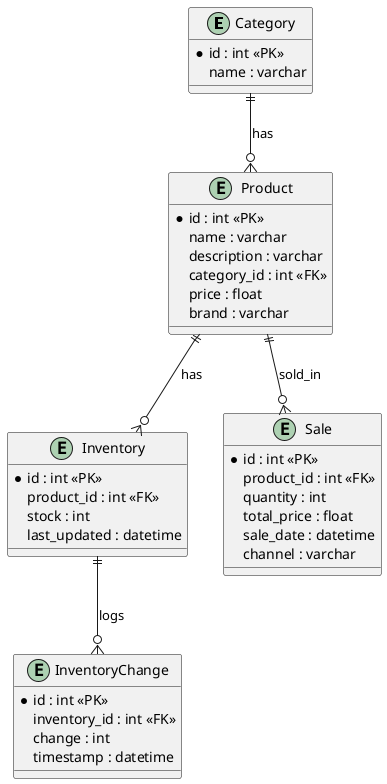

# Database Schema Documentation

## Entity-Relationship Diagram (ERD)

### ASCII Art Overview

```
+-------------+      +-------------+      +-------------+
|  Category   |<-----|  Product    |----->|  Inventory  |
+-------------+      +-------------+      +-------------+
| id (PK)     |      | id (PK)     |      | id (PK)     |
| name        |      | name        |      | product_id  |
+-------------+      | ...         |      | stock       |
                    | category_id |      | ...         |
                    +-------------+      +-------------+
                          |                   |
                          |                   |
                          v                   v
                    +-------------+      +------------------+
                    |   Sale      |      | InventoryChange  |
                    +-------------+      +------------------+
                    | id (PK)     |      | id (PK)          |
                    | product_id  |      | inventory_id     |
                    | quantity    |      | change           |
                    | total_price |      | timestamp        |
                    | sale_date   |      +------------------+
                    | channel     |
                    +-------------+
```

### PlantUML (for PNG rendering)



---

## Table Descriptions

### Category
- **id**: Primary key
- **name**: Category name (unique)
- **products**: Relationship to Product

### Product
- **id**: Primary key
- **name**: Product name
- **description**: Product description
- **category_id**: Foreign key to Category
- **price**: Product price
- **brand**: Brand name
- **inventory**: One-to-one relationship to Inventory
- **sales**: One-to-many relationship to Sale

### Inventory
- **id**: Primary key
- **product_id**: Foreign key to Product (unique)
- **stock**: Current stock level
- **last_updated**: Timestamp of last update
- **changes**: One-to-many relationship to InventoryChange

### InventoryChange
- **id**: Primary key
- **inventory_id**: Foreign key to Inventory
- **change**: Change in stock (positive or negative)
- **timestamp**: When the change occurred

### Sale
- **id**: Primary key
- **product_id**: Foreign key to Product
- **quantity**: Number of units sold
- **total_price**: Total price for the sale
- **sale_date**: Date and time of sale
- **channel**: Sales channel (e.g., Amazon, Walmart)

---

## Relationships
- **Category 1---* Product**: Each category can have multiple products.
- **Product 1---1 Inventory**: Each product has one inventory record.
- **Inventory 1---* InventoryChange**: Each inventory record can have multiple change logs.
- **Product 1---* Sale**: Each product can have multiple sales records.

---

## Notes
- All foreign keys are indexed for performance.
- The schema is normalized to avoid redundancy and ensure consistency.
- Inventory changes are tracked for audit/history.

---

## How to Render the ER Diagram
- Use the PlantUML code block above with any PlantUML renderer (e.g., https://plantuml.com/plantuml).
- Or use the ASCII art for a quick overview.

---

## Codebase Structure & Key Files

- **main.py**: FastAPI entrypoint. Initializes the app and includes the main router.
- **db.py**: SQLAlchemy engine/session setup. Loads DB credentials from environment variables.
- **models.py**: SQLAlchemy ORM models for all tables (Category, Product, Inventory, InventoryChange, Sale).
- **schemas.py**: Pydantic models for request/response validation.
- **crud.py**: CRUD and analytics logic for all entities, including revenue and sales analysis.
- **dependencies.py**: FastAPI dependency for DB session management.
- **routers.py**: All API endpoints (products, inventory, sales, revenue) are defined here using FastAPI's APIRouter.
- **demo_data.py**: Script to create tables and populate the database with demo data (categories, products, inventory, sales for Amazon & Walmart).
- **Dockerfile**: Containerizes the FastAPI app.
- **docker-compose.yml**: Orchestrates both the FastAPI app and MySQL database, ensuring demo data is loaded on startup.
- **.env / .env.example**: Environment variable files for DB credentials (used by both app and Docker Compose).

## API Endpoint Organization
- All endpoints are grouped in `routers.py` using FastAPI's APIRouter.
- Endpoints cover product registration, inventory management, sales data, and revenue analytics.
- Each endpoint uses Pydantic schemas for input/output and SQLAlchemy for DB operations.
- The app is fully documented via FastAPI's auto-generated OpenAPI docs at `/docs`. 